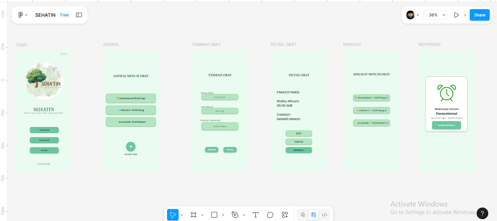

### Nama: Dira Rohmaeni
### NIM: 312410465
### Kelas: TI.24.A5

# langkah langkah praktikum 6 Twitter Bootstrap

1. Buat folder dengan nama LAB6_BOOTSTRAP
2. Kemudian buat file dengan nama index.html lalu ketik kode berikut.
```html
<!DOCTYPE html>
<html lang="en">
  <head>
    <meta charset="UTF-8" />
    <meta name="viewport" content="width=device-width, initial-scale=1.0" />
    <title>Refactor Layout Praktikum 4</title>
    <link
      href="https://cdn.jsdelivr.net/npm/bootstrap@5.3.3/dist/css/bootstrap.min.css"
      rel="stylesheet"
      integrity="sha384-QWTKZyjpPEjISv5WaRU9OFeRpok6YctnYmDr5pNlyT2bRjXh0JMhjY6hW+ALEwIH"
      crossorigin="anonymous"
    />
    </head>
    <body>
<body>
    <header>
      <nav class="navbar navbar-expand-lg navbar-dark bg-dark">
      <div class="container-fluid">
        <a class="navbar-brand" href="#">Praktikum 6</a>
        <button
          class="navbar-toggler"
          type="button"
          data-bs-toggle="collapse"
          data-bs-target="#navbarNav"
        >
          <span class="navbar-toggler-icon"></span>
        </button>
<div class="collapse navbar-collapse" id="navbarNav">
          <ul class="navbar-nav">
            <li class="nav-item">
              <a class="nav-link active" href="index.html">Home</a>
            </li>
            <li class="nav-item"><a class="nav-link" href="#">Artikel</a></li>
            <li class="nav-item">
              <a class="nav-link" href="form.html">Form</a>
            </li>
            <li class="nav-item">
              <a class="nav-link" href="portfolio.html">Portfolio</a>
            </li>
          </ul>
        </div>
      </div>
    </nav>
    </header>
    <div class="container my-4">
      <div class="p-5 mb-4 bg-light rounded-3 shadow-sm">
        <div class="container-fluid py-3">
          <h1 class="display-6 fw-bold">Selamat Datang di Layout Bootstrap!</h1>
          <p class="fs-5">
            Ini adalah hasil refactoring layout manual Praktikum 4 menggunakan
            Bootstrap Grid System.
          </p>
        </div>
      </div>
    </body>
</html>
```
Kemudian buka Browser untuk melihat hasilnya


3. Selanjutnya ketik kode berikut untuk menambahkan Artikel & Fitur Utama
```html
<div class="row">
        <div class="col-md-8">
          <h3 class="mb-3">Artikel & Fitur Utama</h3>

          <div class="row text-center mb-4">
            <div class="col-md-4 mb-3">
              <div class="card h-100 p-3 shadow-sm border-0">
                
                <div class="card-body">
                  <h5 class="card-title fw-bold">Heading</h5>
                  <p class="card-text text-muted">
                    Donec sed odio dui. Etiam porta sem malesuada magna mollis
                    euismod.
                  </p>
                  <a href="#" class="btn btn-secondary btn-sm">View detail</a>
                </div>
              </div>
            </div>
            <div class="col-md-4 mb-3">
              <div class="card h-100 p-3 shadow-sm border-0">
                
                <div class="card-body">
                  <h5 class="card-title fw-bold">Heading</h5>
                  <p class="card-text text-muted">
                    Donec sed odio dui. Etiam porta sem malesuada magna mollis
                    euismod.
                  </p>
                  <a href="#" class="btn btn-secondary btn-sm">View detail</a>
                </div>
              </div>
            </div>
            <div class="col-md-4 mb-3">
              <div class="card h-100 p-3 shadow-sm border-0">
                
                <div class="card-body">
                  <h5 class="card-title fw-bold">Heading</h5>
                  <p class="card-text text-muted">
                    Donec sed odio dui. Etiam porta sem malesuada magna mollis
                    euismod.
                  </p>
                  <a href="#" class="btn btn-secondary btn-sm">View detail</a>
                </div>
              </div>
            </div>
          </div>
```
Kemudia buka Browser untuk melihat hasilnya


4. Selanjutnya ketik kode berikut untuk menambahkan First featurette heading
```html
 <hr class="mb-4" />
          <article class="py-3">
            <hr class="divider" />
            <article class="entry">
              <h2>First featurette heading.</h2>
              
              <p>Lorem ipsum dolor sit amet, consectetur adipiscing elit. Vestibulum lorem
                elit, iaculis in nisl volutpat, malesuada tincidunt arcu. Proin in leo fringilla,
                vestibulum mi porta, faucibus felis. Integer pharetra est nunc, nec pretium nunc
                pretium ac.</p>
            </article>
            <hr class="divider" />
            <article class="entry">
              <h2>First featurette heading.</h2>
              
              <p>Lorem ipsum dolor sit amet, consectetur adipiscing elit. Vestibulum lorem
                elit, iaculis in nisl volutpat, malesuada tincidunt arcu. Proin in leo fringilla,
                vestibulum mi porta, faucibus felis. Integer pharetra est nunc, nec pretium nunc
                pretium ac.</p>
              </article>
```
Kemudia buka Browser untuk melihat hasilnya


5. Selanjutnya ketik kode berikut untuk menambahkan View detail Heading
``html
<div class="col-md-4">
          <h3 class="mb-3">Sidebar Widget</h3>

          <div class="card mb-3 shadow-sm">
            <div class="card-header bg-light fw-bold">Widget Link</div>
            <ul class="list-group list-group-flush">
              <li class="list-group-item">
                <a href="#" class="text-decoration-none text-primary">Link 1</a>
              </li>
              <li class="list-group-item">
                <a href="#" class="text-decoration-none text-primary">Link 2</a>
              </li>
              <li class="list-group-item">
                <a href="#" class="text-decoration-none text-primary">Link 3</a>
              </li>
              <li class="list-group-item">
                <a href="#" class="text-decoration-none text-primary">Link 4</a>
              </li>
            </ul>
          </div>
          ```
Kemudia buka Browser untuk melihat hasilnya


6. Selanjutnya ketik kode berikut untuk menambahkan Sidebar Widget
          ```html
          <div class="card shadow-sm">
            <div class="card-header bg-light fw-bold">Widget Text</div>
            <div class="card-body">
              <p class="card-text text-secondary">
                Vestibulum lorem elit, iaculis in nisl volutpat, malesuada
                tincidunt arcu. Proin in leo fringilla, vestibulum mi porta,
                faucibus felis.
              </p>
            </div>
          </div>
        </div>
      </div>
    </div>
    ```
Kemudia buka Browser untuk melihat hasilnya


7. selanjutnya ketik kode berikut untuk menambahkan footer
    <footer class="bg-dark text-white text-center py-3 mt-4">
      <p class="mb-0">&copy; 2024 Refactored with Bootstrap</p>
    </footer>
    </body>
    ```
Kemudia buka Browser untuk melihat hasilnya


8. Kemudian buat file dengan nama form.html lalu ketik kode berikut.
```html
<!DOCTYPE html>
<html lang="en">
  <head>
    <meta charset="UTF-8" />
    <meta name="viewport" content="width=device-width, initial-scale=1.0" />
    <title>Form Input Data & Validasi - Praktikum 5 & 6</title>

    <link
      href="https://cdn.jsdelivr.net/npm/bootstrap@5.3.3/dist/css/bootstrap.min.css"
      rel="stylesheet"
      integrity="sha384-QWTKZyjpPEjISv5WaRU9OFeRpok6YctnYmDr5pNlyT2bRjXh0JMhjY6hW+ALEwIH"
      crossorigin="anonymous"
    />

  <body>
    <div class="container my-5">
      <div class="row justify-content-center">
        <div class="col-lg-6 col-md-8">
          <h2 class="mb-4 text-center">Form Input Data</h2>
</html>
```

Selanjutnya
```html
<form name="myForm" onsubmit="return validasiForm()">
            <div class="mb-3">
              <label for="inputNama" class="form-label">Nama Lengkap</label>
              <input
                type="text"
                class="form-control"
                id="inputNama"
                name="inputNama"
                placeholder="Masukkan nama Anda di sini"
              />
            </div>
```

lanjuut
```html
 <div class="mb-3">
              <label for="inputEmail" class="form-label">Alamat Email</label>
              <input
                type="text"
                class="form-control"
                id="inputEmail"
                name="inputEmail"
                placeholder="nama@contoh.com"
              />
            </div>
```

lanjut
```html
<div class="mb-3">
              <label for="inputPesan" class="form-label"
                >Pesan / Komentar</label
              >
              <textarea
                class="form-control"
                id="inputPesan"
                name="inputPesan"
                rows="4"
                placeholder="Tulis pesan Anda..."
              ></textarea>
            </div>
```

lanjut
```html
<div class="mb-3">
              <label for="inputTopik" class="form-label">Pilih Topik</label>
              <select class="form-select" id="inputTopik" name="inputTopik">
                <option selected>Pilih salah satu...</option>
                <option value="1">Layanan Informasi</option>
                <option value="2">Permintaan Dukungan</option>
                <option value="3">Masukan Umum</option>
              </select>
            </div>
```

lanjut
```html
<div class="d-grid mt-4">
              <button type="submit" class="btn btn-primary btn-lg">
                Kirim Formulir
              </button>
            </div>
          </form>
        </div>
      </div>
    </div>
```

# Fortpolio
```html
<!DOCTYPE html>
<html lang="en">
  <head>
    <meta charset="UTF-8" />
    <meta name="viewport" content="width=device-width, initial-scale=1.0" />
    <title>Portfolio Sederhana - [Dira Rohmaeni]</title>
    <link
      href="https://cdn.jsdelivr.net/npm/bootstrap@5.3.3/dist/css/bootstrap.min.css"
      rel="stylesheet"
      integrity="sha384-QWTKZyjpPEjISv5WaRU9OFeRpok6YctnYmDr5pNlyT2bRjXh0JMhjY6hW+ALEwIH"
      crossorigin="anonymous"
    />

    <style>
      .section-padding {
        padding: 80px 0;
      }
    </style>
  </head>

   <body>
    <nav
      class="navbar navbar-expand-lg navbar-dark bg-dark sticky-top shadow-sm"
    >
      <div class="container">
        <a class="navbar-brand fw-bold" href="#">[Dira Rohmaeni] Portfolio</a>
        <button
          class="navbar-toggler"
          type="button"
          data-bs-toggle="collapse"
          data-bs-target="#navbarNav"
        >
          <span class="navbar-toggler-icon"></span>
        </button>
        <div class="collapse navbar-collapse" id="navbarNav">
          <ul class="navbar-nav ms-auto">
            <li class="nav-item">
              <a class="nav-link active" href="#tentang">Tentang Saya</a>
            </li>
            <li class="nav-item">
              <a class="nav-link" href="#portfolio">Portfolio Saya</a>
            </li>
          </ul>
        </div>
      </div>
    </nav>
</html>
```

lanjut
```html
 <section id="tentang" class="section-padding bg-light">
      <div class="container">
        <div class="row align-items-center">
          <h2 class="text-center mb-5 fw-light">Tentang Saya</h2>

          <div class="col-md-4 text-center mb-4 mb-md-0">
            
          </div>
```

lanjut
```html
<div class="col-md-8">
            <h1 class="display-4">[Dira Rohmaeni]</h1>
            <p class="lead text-primary">
              Web Developer | Mahasiswa Pemrograman Web
            </p>
            <p class="mt-4">
              Saya adalah seorang mahasiswa/profesional yang berfokus pada
              pengembangan web front-end. Saya memiliki keahlian dalam
              menggunakan **HTML5**, **CSS3**, dan **Bootstrap** untuk membangun
              antarmuka pengguna yang responsif, modern, dan mudah digunakan.
              Proyek-proyek yang saya kerjakan berorientasi pada fungsionalitas
              dan desain yang bersih.
            </p>
            <a href="#portfolio" class="btn btn-dark mt-3">Lihat Proyek Saya</a>
          </div>
        </div>
      </div>
    </section>
```

lanjut
```html
 <section id="portfolio" class="section-padding">
      <div class="container">
        <h2 class="text-center mb-5 fw-light">Portfolio Saya</h2>

        <div class="row">
          <div class="col-md-4 mb-4">
            <div class="card h-100 shadow">
              
              <div class="card-body">
                <h5 class="card-title text-primary">
                  Sistem Informasi Akademik
                </h5>
                <p class="card-text">
                  Pengembangan dashboard admin yang fungsional dan responsif
                  menggunakan Bootstrap Grid System.
                </p>
                <a href="#" class="btn btn-sm btn-outline-primary"
                  >Lihat Detail</a
                >
              </div>
            </div>
          </div>

          <div class="col-md-4 mb-4">
            <div class="card h-100 shadow">
              
              <div class="card-body">
                <h5 class="card-title text-primary">UI&UX Project</h5>
                <p class="card-text">
                  Desain ulang landing page untuk peningkatan konversi. Fokus
                  pada hero section dan testimonial card.
                </p>
                <a href="#" class="btn btn-sm btn-outline-primary"
                  >Lihat Detail</a
                >
              </div>
            </div>
          </div>

          <div class="col-md-4 mb-4">
            <div class="card h-100 shadow">
              
              <div class="card-body">
                <h5 class="card-title text-primary">
                  Aplikasi Form Input Validasi
                </h5>
                <p class="card-text">
                  Penerapan form styling Bootstrap dengan penambahan JavaScript
                  untuk validasi real-time.
                </p>
                <a href="#" class="btn btn-sm btn-outline-primary"
                  >Lihat Detail</a
                >
              </div>
            </div>
          </div>
        </div>
      </div>
    </section>
```

lanjut
```html
 <footer class="bg-dark text-white text-center py-3">
      <div class="container">
        <p class="mb-0">Dibuat dengan Bootstrap &copy; 2024</p>
      </div>
    </footer>
```
